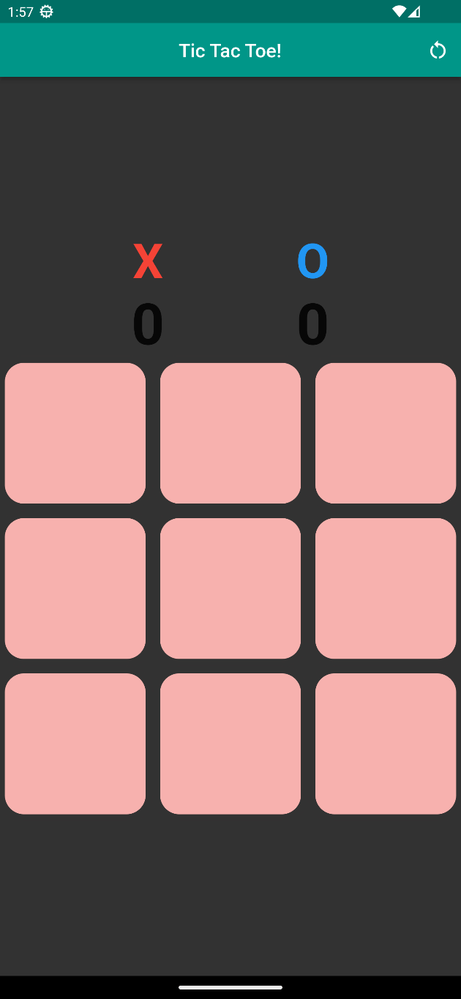

# Tic Tac Toe in Flutter

A simple implementation of Tic Tac Toe game using Flutter framework.

## Screenshots

## Demo

## Getting Started

1. Install Flutter on your machine.
2. Clone this repository.
3. Open the project in your preferred IDE.
4. Run the app on an emulator or a physical device.

## How to Play

1. Choose X or O to start the game.
2. Tap on a cell to place your symbol.
3. The game ends when one player gets three in a row or all cells are filled.
4. Click the restart button on the top right to restart the game.
